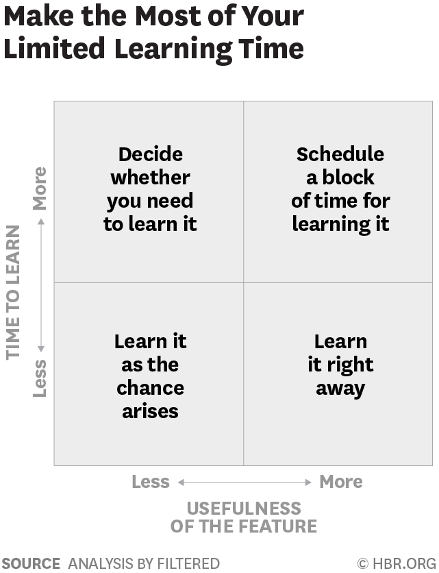

# Getting Started

## On Siraj Videos

[this](https://www.youtube.com/watch?v=Cr6VqTRO1v0)

Hiring page of DeepMind.

Pie chart of composition

Linear Algebra,

Probability and Statistics,

Calculus,

Algorithms and Complexity,

Data pre-processing

Pillars of Machine Learning:

Optimization

Data pre processing

Types of Learning

Dataset splitting

Model Evaluation

Another [one](https://www.youtube.com/watch?v=waXHrc2m9K8)

1. Live a healthy lifestyle

Exercise what you enjoy

Food:

drink lots of water

Paleo diet.

3 times a week full body workout with weights

Good night sleep

try to isolate from the world before going to sleep

keeping phone in airplane mode 2 hours before sleep.

one 24 hour period of disconnected per week

2. Optimize the learning environment

dedicate Clean work environment like office separated from where you sleep or eat.

dont have a cluttered desk.

working in a library or coffee shop, why not?

3. Personalized learning path

Update the curriculum if you feel the way.

twitter

@100DaysOfMLCode

4. Prioritising

Create TODO lists

for

day

week

month

year

5. Be an active learner

FAST framework

Forget, Activate, State, Teach

Forget three things

